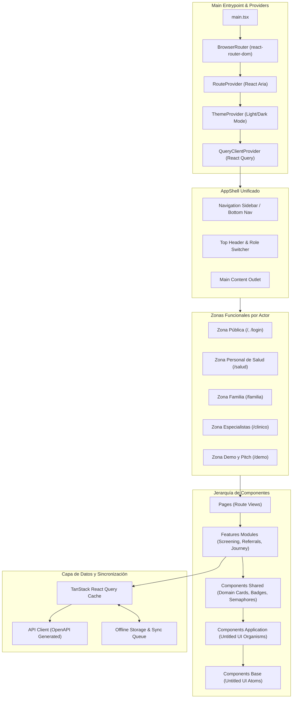

# 🏛️ Arquitectura Técnica del Frontend — Neuroalianza

> **Proyecto:** Neuroalianza (Hackatón INSN San Borja 2026 — Desafío 04: Neurodesarrollo)  
> **Stack:** React 19, TypeScript, Vite 8, React Compiler, Untitled UI React (React Aria Components), Tailwind CSS, TanStack React Query.

---

## 1. Visión y Topología de la Aplicación

El frontend de **Neuroalianza** implementa una arquitectura modular de Single Page Application (SPA), optimizada para ofrecer tres experiencias de usuario altamente diferenciadas sobre una base compartida y coherente:



---

## 2. Composición de Providers en `main.tsx`

La jerarquía de providers es indispensable para asegurar el correcto enrutamiento en componentes accesibles de React Aria y el soporte de temas:

```tsx
// src/main.tsx
import React from "react";
import ReactDOM from "react-dom/client";
import { BrowserRouter } from "react-router-dom";
import { QueryClient, QueryClientProvider } from "@tanstack/react-query";
import { RouteProvider } from "@/providers/route-provider";
import { ThemeProvider } from "@/providers/theme-provider";
import { App } from "@/App";
import "@/styles/globals.css";

const queryClient = new QueryClient({
  defaultOptions: {
    queries: {
      staleTime: 1000 * 60 * 5, // 5 minutos de caché
      retry: 2,
    },
  },
});

ReactDOM.createRoot(document.getElementById("root")!).render(
  <React.StrictMode>
    <BrowserRouter>
      <RouteProvider>
        <ThemeProvider>
          <QueryClientProvider client={queryClient}>
            <App />
          </QueryClientProvider>
        </ThemeProvider>
      </RouteProvider>
    </BrowserRouter>
  </React.StrictMode>
);
```

> [!NOTE]
> `RouteProvider` es obligatorio para que los enlaces internos de Untitled UI / React Aria no provoquen recargas duras del navegador.

---

## 3. Zonas Funcionales y Rutas de la Aplicación

El sistema se estructura en **5 zonas** con configuraciones de navegación y paletas de acento adaptadas a cada rol:

```
src/pages/
├── public/
│   ├── LandingPage.tsx              # / -> Propuesta de valor, estadísticas y comparativa
│   └── LoginPage.tsx                # /login -> Selector rápido de usuarios demo
├── health-worker/
│   ├── HealthWorkerDashboard.tsx    # /salud -> Métricas locales, pacientes pendientes
│   ├── ScreeningWizardPage.tsx      # /salud/tamizaje/nuevo -> Cuestionario interactivo
│   ├── ScreeningResultPage.tsx      # /salud/tamizaje/:id -> Resultado de riesgo y derivación
│   └── HealthWorkerCasesPage.tsx    # /salud/pacientes -> Lista de derivaciones de la posta
├── family/
│   ├── FamilyHomePage.tsx           # /familia -> Resumen familiar y estado actual
│   ├── JourneyPage.tsx              # /familia/ruta -> Visualización de la Ruta de Atención
│   ├── FamilyAppointmentsPage.tsx   # /familia/citas -> Confirmación/Declinación de citas
│   ├── HomeActivitiesPage.tsx       # /familia/actividades -> Guías terapéuticas para el hogar
│   └── VideoUploadPage.tsx          # /familia/video -> Envío seguro de grabaciones caseras
├── specialist/
│   ├── SpecialistDashboard.tsx      # /clinico -> Bandeja de entrada y alertas prioritarias
│   ├── IncomingReferralsPage.tsx    # /clinico/referencias -> Evaluación y admisión
│   ├── ConsolidatedCasePage.tsx     # /clinico/casos/:id -> Ficha Multidisciplinaria 360°
│   ├── SpecialistSchedulePage.tsx   # /clinico/agenda -> Calendario y bloques agrupados
│   ├── EvaluationWizardPage.tsx     # /clinico/casos/:id/evaluacion -> Registro de evaluación
│   └── ClinicalMetricsPage.tsx      # /clinico/metricas -> Tiempos de espera y deserción
└── demo/
    └── DemoControlPanelPage.tsx     # /demo -> Simulación de reloj, disparo de alertas y reset
```

---

## 4. Jerarquía y Encapsulamiento de Componentes

Para mantener el código ordenado y evitar el acoplamiento:

```
┌─────────────────────────────────────────────────────────────┐
│ 1. Base Components (src/components/base/)                   │
│    Átomos puros de Untitled UI: Button, Input, Badge, Tag   │
└──────────────────────────────┬──────────────────────────────┘
                               │
                               ▼
┌─────────────────────────────────────────────────────────────┐
│ 2. Application Components (src/components/application/)     │
│    Moléculas y organismos: Modals, Slideouts, Table, Sidebar│
└──────────────────────────────┬──────────────────────────────┘
                               │
                               ▼
┌─────────────────────────────────────────────────────────────┐
│ 3. Shared Domain Components (src/components/shared/)        │
│    Componentes de negocio: SemaforoRiesgo, TimelineItem     │
└──────────────────────────────┬──────────────────────────────┘
                               │
                               ▼
┌─────────────────────────────────────────────────────────────┐
│ 4. Features (src/features/*)                                │
│    Lógica y estado de flujos: useScreening, useJourney      │
└──────────────────────────────┬──────────────────────────────┘
                               │
                               ▼
┌─────────────────────────────────────────────────────────────┐
│ 5. Pages (src/pages/*)                                      │
│    Vistas de ruta conectadas al enrutador                   │
└─────────────────────────────────────────────────────────────┘
```

---

## 5. Estrategia de Datos y Sincronización Offline

1. **Cliente API Fuertemente Tipado:** Generado automáticamente desde `contracts/openapi.json` del backend para asegurar consistencia de contratos sin llamadas escritas a mano.
2. **TanStack React Query:** Centraliza el estado del servidor, revalidaciones automáticas, estados de carga (`isLoading`, `isFetching`) y paginación por cursor.
3. **Cola Offline de Tamizaje:** Para personal de CRED sin conexión:
   * Los cuestionarios completados se almacenan en `LocalStorage`/`IndexedDB`.
   * Un indicador visual en la barra superior muestra el estado de conectividad y registros pendientes de sincronizar.
   * Al restablecerse la conexión, la cola despacha peticiones idempotentes con `Idempotency-Key` único.
